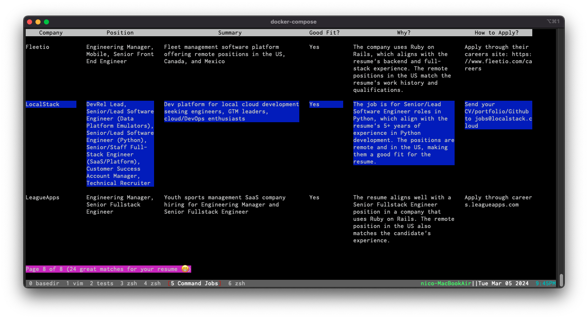
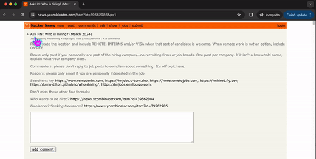
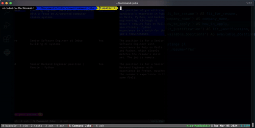

# Command Jobs

Command Jobs is a terminal-based job finder and application tracker for software engineers


Use Command Jobs to streamline your job search and quickly find listings that are the best fit for your skills, experience and preferences


## Features

- View and navigate matched job listings directly from the terminal
    

- Scrape job listings from "Ask HN: Who's hiring?" posts on Hacker News

    

- Process listings with GPT to find the best matches for you

    * The app asks GPT for each job listing, if it's a good fit for your resume
    * The prompt includes the resume, the job listing, a section for json formating the results, a role description, a job preferences section, and some additional questions
    * You get a filtered list of the best matches for your resume and preferences


## In the works

- Track job applications directly in the terminal
- Scrape job listings from additional sources
- Add cronjob that runs periodically to scrape
- Alerts about new matches found

- Anything you'd like to see? Please add a ticket


## Usage



After going through the Configuration and successfully running Command Jobs

You will get a menu with the options below. To navigate the menu, just use the arrow keys and select options with Enter. You can quit at any time by pressing `q`

When first running the app, open the Edit Resume section and paste the text of your resume, no need to include your name or contact info

Then, get some job listings into the app by running Scrape "Ask HN: Who's hiring?". You can see the first few listings in the Navigate jobs in the local db section (if you want to see more, you can also open `job_listings.db` directly with sqlite3 and check out the contents)

For the next step, make sure you've reviewed your `.env` file and have adapted the prompts to your preferences for job matching

Once you have your Resume ready, jobs in the local db and the prompts configured, run Find best matches for resume with AI. That will run through the listings to find a match of your resume and job preferences

When the GPT analysis is done, you get access to the AI found X listings match your resume option, where you can navigate the best matches found


The menu includes:

- **Edit Resume**: Add or replace the text of your resume for AI matching
- **Scrape "Ask HN: Who's hiring?"**: Scrape job listings from Hacker News
- **Navigate jobs in the local db**: Browse listings stored locally
- **Find best matches for resume with AI**: Match listings to your resume using AI
- **AI found X listings match your resume**: Review personalized job matches

To exit the application, press `q`


## How to Run the Application

* Clone the repository:

    - `git clone https://github.com/nicobrenner/commandjobs.git`
    - `cd commandjobs`


### Running via Docker

1. Build the Docker image:

    `docker-compose up build app`

2. Run the Docker container (make sure you've setup your OpenAI API key in your `.env` file - see Configuration section below):

    `docker-compose run app`

3. Alternatively, you can make `commandjobs.sh` executable and run it:

    - `chmod +x commandjobs.sh`
    - `./commandjobs.sh`


### Running Directly via Python in a Virtual Environment


2. Set up a Python virtual environment and activate it:

    `python3 -m venv venv`
    `source venv/bin/activate`

3. Install the dependencies:

    `pip3 install -r requirements.txt`

4. Run the application:

    `python3 main.py`


## Configuration

1. Create a `.env` file in the root directory of the project by copying the sample.env file, and adding your OpenAI API key:

    `cp sample.env .env`
    edit the .env file
    to add your OpenAI API key
    ```
    OPENAI_API_KEY=your_openai_api_key_here
    OPENAI_GPT_MODEL=gpt-3.5-turbo

    BASE_RESUME_PATH=/repo/base_resume.txt
    DB_PATH=/repo/job_listings.db
    HN_START_URL=https://news.ycombinator.com/item?id=39562986&p=1

    ...
    ```
    Note: the above HN_START_URL is for March 2024


    ### Obtaining an OpenAI API Key

    If you don't have an OpenAI API key, [follow these instructions](https://openai.com/blog/openai-api) to obtain one.

2. Modify the prompt so that it matches your preferences. The prompt has #X sections:

    * COMMANDJOBS_ROLE: list the roles that you are looking for
        ```
        COMMANDJOBS_ROLE=backend engineer, or fullstack engineer, or senior engineer, or senior tech lead, or engineering manager, or senior enginering manager, or founding engineer, or founding fullstack engineer, or something like similar
        ```
    
    * COMMANDJOBS_IDEAL_JOB_QUESTIONS: explain what is a good fit for you
        ```
        COMMANDJOBS_IDEAL_JOB_QUESTIONS=and the company uses either Ruby, Rails, Ruby on Rails, or Python, the positions doesn't require any knowledge or experience in any of the following: {job_requirement_exclusions}, the position is remote, it's for the US and the description matches the resume? (Yes or No), justify the Yes or No about the role being a good fit for the experience of the resume in one sentence.
        ```
    
    * COMMANDJOBS_EXCLUSIONS: list things to avoid (this takes some trial and error to get right, iterating with the matches you get each time)
        ```
        COMMANDJOBS_EXCLUSIONS=VMS (video management systems), computer vision systems, Java, C++, C#, Grails, ML, Machine Learning, PyTorch, training models
        ```
    * COMMANDJOBS_PROMPT: the prompt includes all the other elements as well as the questions that we want answers about from GPT
        ```
        COMMANDJOBS_PROMPT=Given the below html of a job listing, and text of a resume. Listing:\n{job_html}\n\nResume:\n{resume}\n\nPlease provide the following information about the listing: brief 2 sentence summary of the listing, company name, [list of available positions, with individual corresponding links if available], tech stack description, do they use rails? (Yes or No), do they use python? (Yes or No), are the positions remote (not hybrid, not onsite)? (Yes or No), are they hiring in the US? (Yes or No), how to apply to the job? (provide 1 sentence max description, include link or email address if necessary), Does the role prioritize candidates with a background in a specific industry sector (e.g., tech, finance, healthcare)?, does the job seem like a good fit for the resume (Only say Yes if the role is for {roles} {ideal_job_questions}\n\nProvide output in JSON format, use this example for reference, always with the same keys, but replace the values with the answers for the previous requests for information: \n{output_format}
        ```
    * COMMANDJOBS_OUTPUT_FORMAT: this specifies the output format for the prompt, including an example to follow - it's important that the structure and fields of the format matches the questions from the prompt
        ```
        COMMANDJOBS_OUTPUT_FORMAT="{\n \"small_summary\": \"Wine and Open Source developers for C-language systems programming\",\n \"company_name\": \"CodeWeavers\",\n \"available_positions\": [\n {\n \"position\": \"Wine and General Open Source Developers\",\n \"link\": \"https://www.codeweavers.com/about/jobs\"\n }\n ],\n \"tech_stack_description\": \"C-language systems programming\",\n \"use_rails\": \"No\",\n \"use_python\": \"No\",\n \"remote_positions\": \"Yes\",\n \"hiring_in_us\": \"Yes\",\n \"how_to_apply\": \"Apply through our website, here is the link: https://www.codeweavers.com/about/jobs\",\n \"back_ground_with_priority\": null,\n \"fit_for_resume\": \"No\",\n \"fit_justification\": \"The position is for Wine and Open Source developers, neither of which the resume has experience with. The job is remote in the US\"\n }"
        ```

## Contributing

We welcome contributions, especially in improving scrapers and enhancing user experience. If you'd like to help, please file an issue or pull request on [our GitHub repository](https://github.com/nicobrenner/commandjobs/issues).

## Issues

Encounter any issues? Please file them on the [project's GitHub repo](https://github.com/nicobrenner/commandjobs/issues). We appreciate your feedback and contributions to making Command Jobs better!

## License

This project is open-source and available under the [Apache 2.0 License](LICENSE).

